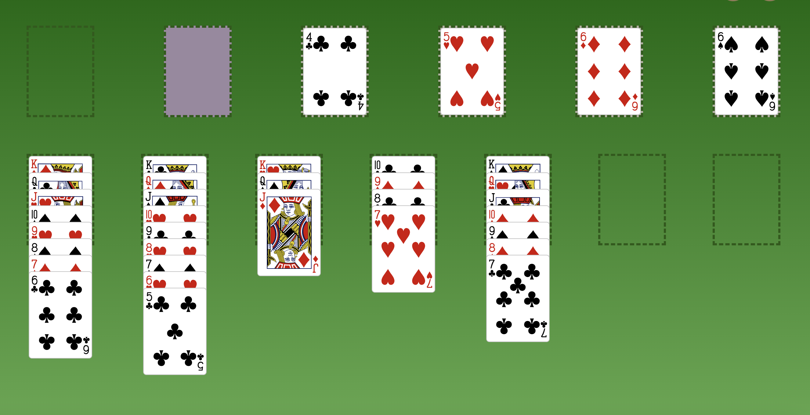
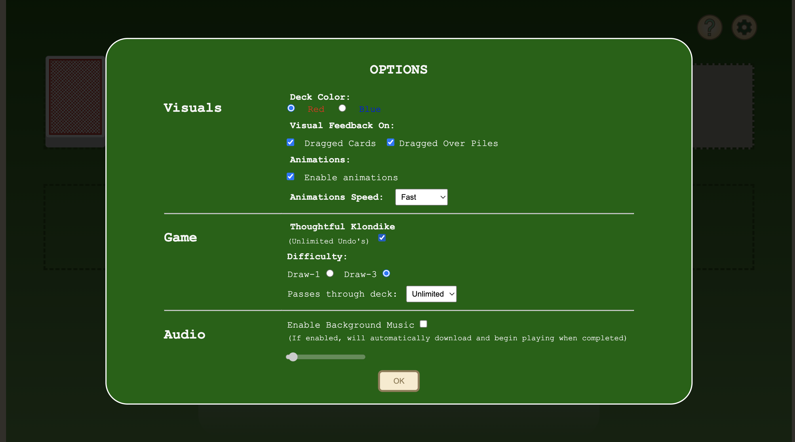
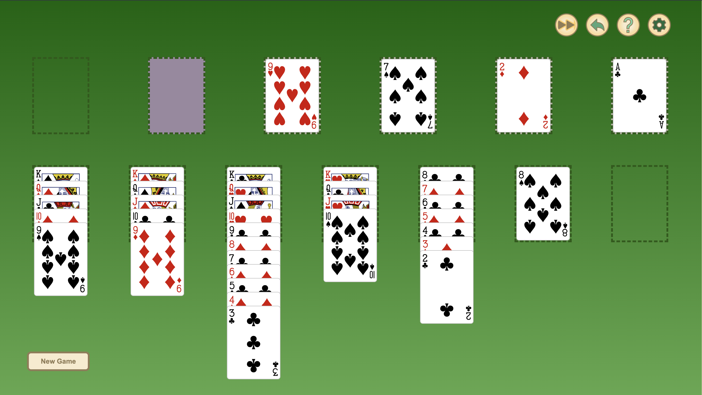
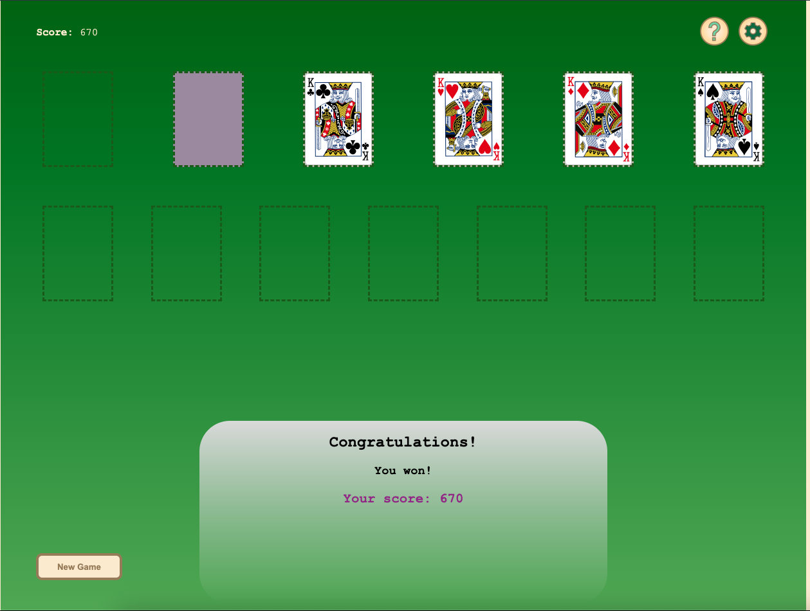

# Solitaire (Klondike) MVP

Welcome to the world of Solitaire!

## Rules

Also known as Patience or Klondike, it is a single player game played with a standard 52-card deck without Jokers. After shuffling, a *tableau* of seven fanned piles of cards are laid from left to right, each pile containing one more card than the last. The first pile on the left contains a single face-up card, the second pile contains two cards,  third pile three cards and so on... The top-most card of each pile is turned face up.

The remaining cards form the *stock* and are placed face-down on the upper left corner.

There are four *foundations* (light-colored rectangles in the screenshots): which are built **up** by suit starting with Ace (which is low in this game) to King. The tableau piles on the other hand can be built **down** in alternate colors.

Every face-up card in a partial pile, or a complete pile, can be moved, as a unit, to another tableau pile on the basis of its highest card. Any empty piles can be filled with a King, or a pile of cards with a King. 

The aim of the game is to build up four stacks of cards starting with Ace and ending with King, all of the same suit, on one of the four foundations, at which time the player would have won.

There are many variations of dealing from the stock to *waste* pile. In this implementation, we have 1 or 3-draw modes, with no limit on passes through the stock (Solitaire has a very low win-rate anyways). You can also simulate a version of Klondike, known as *Thoughtful Solitaire* (through unlimited undos), which is when all the card locations are known to the player (this actually has a win probability of ~80%) - which is still different than playing with all cards face-up (since a smaller face-down card could still be blocking the game).

**Did you know:**
- Any game one can play by themself is called Solitaire, but in North America and many other places, Solitaire will almost always refer to Klondike in the absence of qualifiers around its name
- The probability of being able to win a game of Klondike with best-possible play is not known: [Mathemagician Persi Diaconis](https://en.wikipedia.org/wiki/Persi_Diaconis) described this phenomenon as *"one of embarrassments of applied probability"* [*](https://web.archive.org/web/20041216141330/http://www.math.washington.edu/Seminars/Archives/coll1998-1999.php)
- In 1994 it was said by Microsoft officials that *for years, Solitaire was the most-used application for Windows*. [*](https://en.wikipedia.org/wiki/Klondike_(solitaire)#cite_note-28)

# Screenshots






# Technologies Used

- JavaScript
- HTML
- CSS
- CardStarter CSS Library

# Getting Started
[Click to Play!](./src/index.html)

[Click to view wireframe and initial pesudo-code](./docs/readme.md)

[Click to view the revised event-driven MVC architecture](./docs/events/readme.md)

# Next Steps

+ Save/Load Game
+ UI Improvements
+ Performance Improvements
+ Making mobile-friendly
+ Game Options: Sound effects
+ Game Options: Timer-mode
+ Game Options: (Microsoft® style) scoring system

# Contributing

Contributions are always welcome! Feel free to report bugs or open pull requests.

## For devs

The following classes and instances are assigned to the `window` for easy debugging, if you encounter any bugs they might come in handy for investigating:
```javascript
//---- DEBUGGING -----//
window.Card = Card;
window.Waste = Waste;
window.Deck = Deck;
window.Tableau = Tableau;
window.Foundation = Foundation;
window.Pile = Pile;
window.Solitaire = Solitaire;
window.Renderer = Renderer;
window.renderer = renderer;
window.solitaire = solitaire;
window.setPreventDragging = (val) => preventDragging = val;
window.EventSys = eventSystem;
window.getSortedEventHistory = (descending=true) => {
    const entries = Object.entries(eventSystem.eventDataHistory);
    // sort the inner arrays first
    entries.forEach(entry => entry[1].sort((a, b) => descending ? b.time-a.time : a.time-b.time));
    //then outer
    entries.sort((a,b)=> descending ? b[1][0].time - a[1][0].time : a[1][0].time-b[1][0].time) //forEach(entry=>entry.sort((a,b)=>a[1].time - b[1].time));
    return entries;
}
```
The `EventSys` is a singleton that tracks most going-ons in the game. However, by default it doesn't keep history. Use `EventSys.saveHistory = true` to enable it at anytime.
