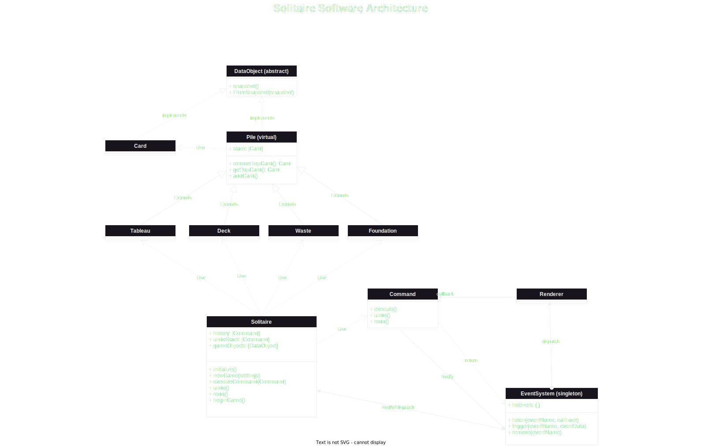

# Solitaire (Klondike)
## Software Architecture
**Event-driven MVC**

## Terminology
Discriminate:
+ Actions
+ Events
+ Commands

`Actions`: are a semantic grouping of `commands` and `events`. Whereas `events` and `commands` have concrete implementations, `actions` do not per se. 

`Events`: every change in game-data or ui state, anything that any part of the game systems, including the player, needs to know of, is an `event`.

`Commands`: are undoable instructions that cause a reversible change in the game state. They inevitably contain 1 or more events.

For instance, beginning a game is an `event`, that is trigerred when the user first clicks on the deck, which then initiates the `action` of dealing from the stock to the tableaux.

Dealing is an `action`, which involves many `move-card` and `flip-top-card-of-stack` events, and no commands (because it's not reversible). While the dealing `action` causes a state change in multiple game-objects they are not reversible, therefore not stored. However, the renderer, depending on the rendering mode (static vs animations enabled), might need to respond to events being raised while dealing.

Another example: `drag-card` and `drag-pile` are events, that are initiated by the user and must get a response from both game-logic (data) classes and the renderer. Similarly `drop-card` and `drop-pile` are similar events (drag&dropping might have additional events required). However once again, they are not `commands`. The commands, that would be triggered at the end of a `drop-pile` event, which would be validated by the game-object (i.e. `Pile` class) which holds the data to the dropped pile in the UI, could be `move-cards`.

Both `comands` and `events` require to pass around some game data, either for validation of states, or rendering purposes.

**Therefore** it becomes imperative to properly define all actions, events and commands available in the game of Solitaire.

## Actions:
A user may:
+ Click on the stock
+ Click on the empty space when the stock is empty
+ Drag a card
+ Drop a card on a valid spot
+ Drop a card on an invalid spot
+ Drag a pile of cards
+ Drop a pile on a valid spot
+ Drop a pile on an invalid spot
+ Pause the game
+ Resume the game
+ Restart the game
+ Double-click an appropriate card to send it to a foundation
+ Double-click on an inappropriate card
+ Request an undo
+ Request a redo
+ Request a fast-forward

Now, on to what events and commands are actually defined by these actions. First of all, undo and redo both trigger commands from a stored array, which should in turn have a sequence of events fired in their proper execute undo and redo methods.

### **Action:** Click on the Stock (has cards in stock)
**Events triggered:**
+ `game-begun`

+ **Action:** Dealing Cards
  + **Events triggered:**
    + `move-card`: 
      + *Data Required:* `{Card, fromPile, toPile}`
    + `flip-top-card-at-pile`:
      + *Data required:* `{Pile}`
+ **Action:** Hitting cards from stock to waste-pile
  + **Command triggered:** 
    + `Hit`:
      + *Data required:* `{Deck, Waste, numberOfCardsToTurn}`
  + **Events triggered:**
    + `move-card` or `move-cards` depending on difficulty
      + *Data required:* `{cardsPile, fromPile, toPile}` (if `move-cards`)
    + `flip-top-card-at-pile` or `flip-top-n-cards-at-pile` 
      + *Data requried:* `{Pile,numCards}` (if `flip-top-n-cards-at-pile`)
### **Action:** Click on the stock (empty)
**Command triggered:**
+ `CollectWastePile`:
  + *Data required:* `{Deck, Waste}`

**Events trigerred:**
+ `move-cards`
+ `flip-all-cards-at-pile`:
  + *Data required:* `{Pile}`
### **Action:** Drag a card
**Events triggered:**
+ `drag-start-card`:
  + *Data required:* `{Card, fromPile}`

### **Action:** Drop a card on a valid spot
**Command triggered:**
+ `MoveCard`:
  + *Data required:* `{Card, fromPile, toPile}`

**Events triggered:**
+ `drag-end-card`:
  + *Data required:* `{Card, fromPile, toPile}`
+ `move-card`:
  + *Data required:* `{Card, fromPile, toPile}`
+ `flip-top-card-at-pile` (if necessary):
  + *Data required:* `{Pile}`

### **Action:** Drop a card on an invalid spot
**Events triggered:**
+ `drag-end-card`:
  + *Data required:* `{Card, fromPile}`
+ `invalid-move-card`:
  + *Data required:* `{Card, attemptedToPile}`

### **Action:** Drag a pile of cards
**Events triggered:**
+ `drag-start-pile`:
  + *Data required:* `{CardsPile, fromPile}`

### **Action:** Drag over a pile (valid spot)
**Events triggered:**
+ `drag-over-pile`:
  + *Data required:* `{draggedPile, hoveredPile}`

### **Action:** Drag over a pile (invalid spot)
**Events triggered:**
+ `drag-over-pile`:
  + *Data required:* `{draggedPile, hoveredPile}`

### **Action:** Drop a pile on a valid spot
**Command triggered:**
+ `MovePile`:
  + *Data required:* `{CardPile, fromPile, toPile}`

**Events triggered:**
+ `drag-end-pile`:
  + *Data required:* `{CardPile, fromPile, toPile}`
+ `move-cards`:
  + *Data required:* `{CardPile, fromPile, toPile}`
+ `flip-top-card-at-pile` (if necessary):
  + *Data required:* `{Pile}`

### **Action:** Drop a pile on an invalid spot
**Events triggered:**
+ `drag-end-pile`:
  + *Data required:* `{CardPile, fromPile}`
+ `invalid-move-pile`:
  + *Data required:* `{CardPile, attemptedToPile}`

### **Action:** Pause the game
**Events triggered:**
+ `game-paused`

### **Action:** Resume the game
**Events triggered:**
+ `game-resumed`

### **Action:** Restart the game
**Events triggered:**
+ `game-restarted`

### **Action:** Double-click an appropriate card to send it to a foundation
**Command triggered:**
+ `AutoMoveCardToFoundation`:
  + *Data required:* `{Card, fromPile, toPile}`

**Events triggered:**
+ `move-card`:
  + *Data required:* `{Card, fromPile, toPile}`

### **Action:** Double-click on an inappropriate card
**Events triggered:**
+ `invalid-auto-move-card`:
  + *Data required:* `{Card, attemptedToPile}`

### **Action:** Request undo
**Events triggered:**
+ Varies based on the command being undone

### **Action:** Request redo

**Events triggered:**
+ Varies based on the command being redone
### **Action:** Request fast-forward
**Events triggered:**

Varies based on game state, possibly combination of:
+ `move-card`, `move-cards`, `flip-top-card-at-pile`, `auto-move-card`